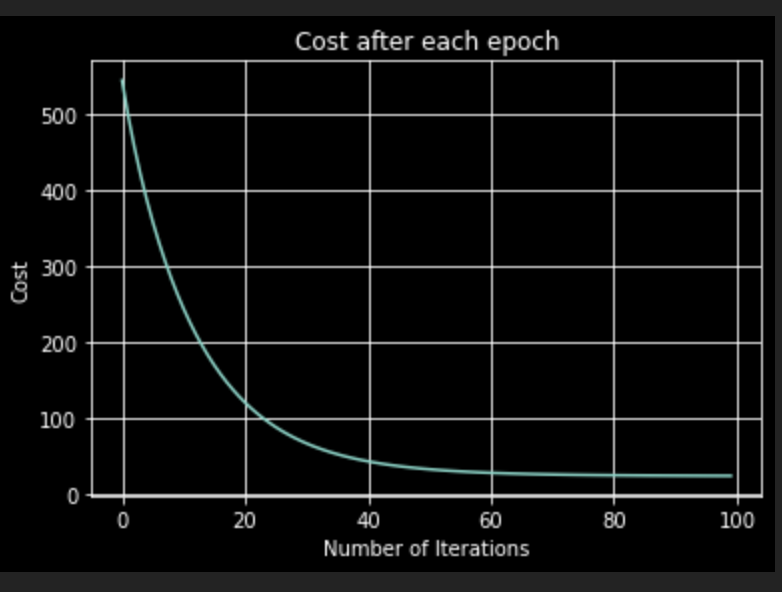
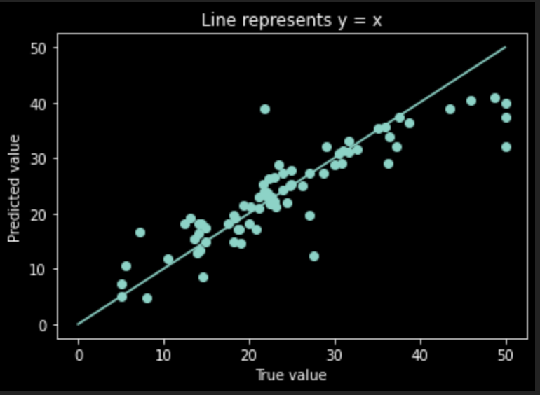

## Boston Dataset

Boston dataset is one of the datasets available in sklearn.

Given a Training dataset csv file with X train and Y train data. 

Task is to come up with Gradient Descent algorithm and thus predictions for the test dataset given.

Predictions are stored in "./Output"

## Results

