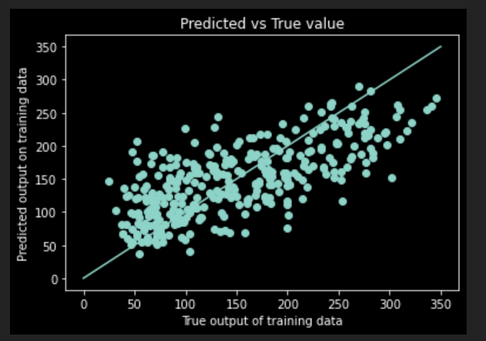
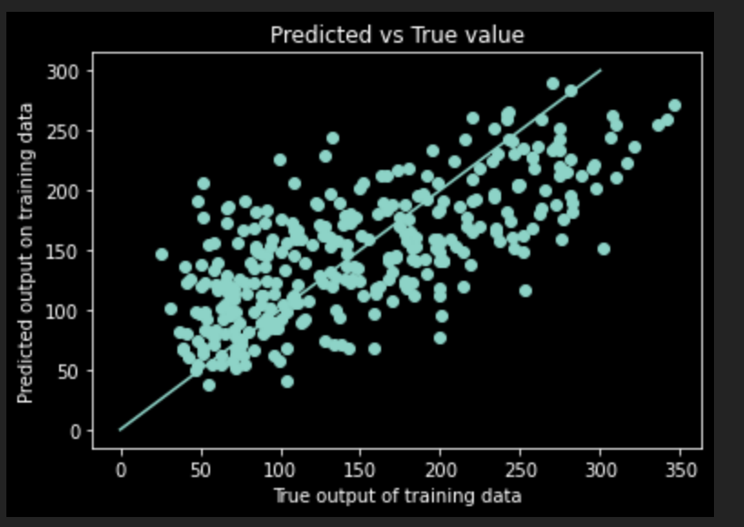

In these problems, I have used Del(Cost)/Del(parametre) = 0 , instead of optimisation algorithm

The method works only for small dataset

## Using sklearn on diabetes dataset

## Implementing From scratch on the same dataset

